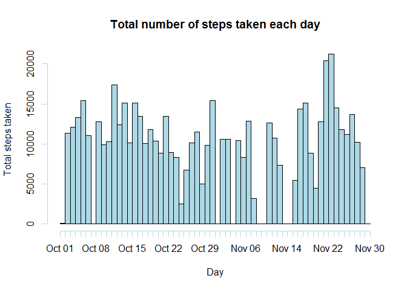
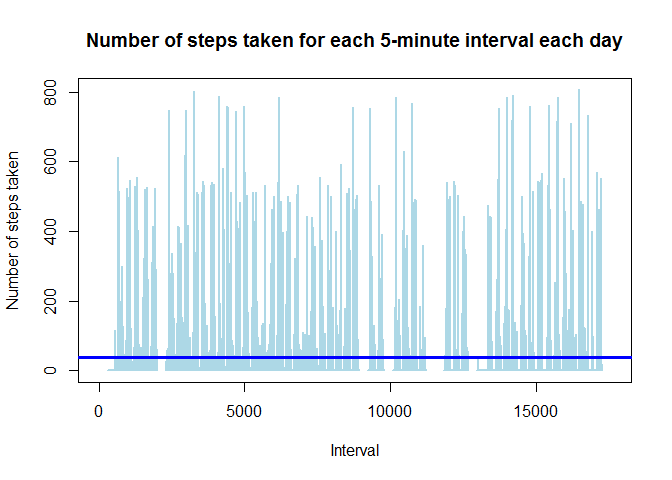
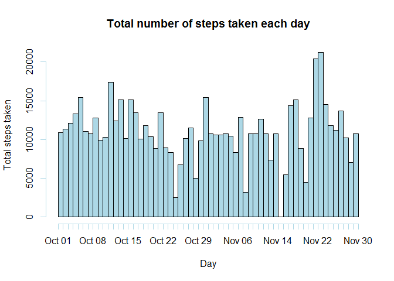
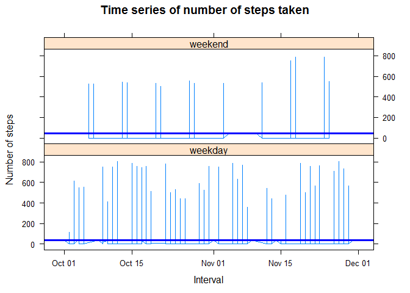

# Reproducible Research: Peer Assessment 1
Choo Che Yon  
October 5, 2016  


## Loading and preprocessing the data

```r
# Read data from file
data <- read.csv("activity.csv")
```


## What is mean total number of steps taken per day?
1. Calculate the total number of steps taken per day.

```r
# Calculate the total number of steps taken per day
totalStepsPerDay <- tapply(X = data$steps, FUN = sum, INDEX = data$date, na.rm = TRUE)
```

```
##            totalStepsPerDay
## 2012-10-01                0
## 2012-10-02              126
## 2012-10-03            11352
## 2012-10-04            12116
## 2012-10-05            13294
## 2012-10-06            15420
## 2012-10-07            11015
## 2012-10-08                0
## 2012-10-09            12811
## 2012-10-10             9900
## 2012-10-11            10304
## 2012-10-12            17382
## 2012-10-13            12426
## 2012-10-14            15098
## 2012-10-15            10139
## 2012-10-16            15084
## 2012-10-17            13452
## 2012-10-18            10056
## 2012-10-19            11829
## 2012-10-20            10395
## 2012-10-21             8821
## 2012-10-22            13460
## 2012-10-23             8918
## 2012-10-24             8355
## 2012-10-25             2492
## 2012-10-26             6778
## 2012-10-27            10119
## 2012-10-28            11458
## 2012-10-29             5018
## 2012-10-30             9819
## 2012-10-31            15414
## 2012-11-01                0
## 2012-11-02            10600
## 2012-11-03            10571
## 2012-11-04                0
## 2012-11-05            10439
## 2012-11-06             8334
## 2012-11-07            12883
## 2012-11-08             3219
## 2012-11-09                0
## 2012-11-10                0
## 2012-11-11            12608
## 2012-11-12            10765
## 2012-11-13             7336
## 2012-11-14                0
## 2012-11-15               41
## 2012-11-16             5441
## 2012-11-17            14339
## 2012-11-18            15110
## 2012-11-19             8841
## 2012-11-20             4472
## 2012-11-21            12787
## 2012-11-22            20427
## 2012-11-23            21194
## 2012-11-24            14478
## 2012-11-25            11834
## 2012-11-26            11162
## 2012-11-27            13646
## 2012-11-28            10183
## 2012-11-29             7047
## 2012-11-30                0
```
  
2. Make a histogram of the total number of steps taken each day.

```r
# Convert the totalStepsPerDay into data.frame
df_stepsPerDay <- as.data.frame(totalStepsPerDay)

# Convert the day into date format
df_stepsPerDay$day <- as.Date(rownames(df_stepsPerDay))

# Prepare data frame for histogram
df_hist <- rep(df_stepsPerDay$day, df_stepsPerDay$totalStepsPerDay)

# Plot the total steps per day in histogram
hist(
    x = df_hist, 
    breaks = seq(min(df_stepsPerDay$day), max(df_stepsPerDay$day), 1),
    main = "Total number of steps taken each day", 
    xlab = "Day", 
    ylab = "Total steps taken",
    freq = TRUE,
    col = "lightblue")
```

<!-- -->
  
3. Calculate and report the mean and median of the total number of steps taken per day.

```r
# Calculate the mean steps for each day.
meanStepsPerDay <- tapply(data$steps, FUN = mean, INDEX = data$date, na.rm =T)
```

```
##            meanStepsPerDay
## 2012-10-01             NaN
## 2012-10-02       0.4375000
## 2012-10-03      39.4166667
## 2012-10-04      42.0694444
## 2012-10-05      46.1597222
## 2012-10-06      53.5416667
## 2012-10-07      38.2465278
## 2012-10-08             NaN
## 2012-10-09      44.4826389
## 2012-10-10      34.3750000
## 2012-10-11      35.7777778
## 2012-10-12      60.3541667
## 2012-10-13      43.1458333
## 2012-10-14      52.4236111
## 2012-10-15      35.2048611
## 2012-10-16      52.3750000
## 2012-10-17      46.7083333
## 2012-10-18      34.9166667
## 2012-10-19      41.0729167
## 2012-10-20      36.0937500
## 2012-10-21      30.6284722
## 2012-10-22      46.7361111
## 2012-10-23      30.9652778
## 2012-10-24      29.0104167
## 2012-10-25       8.6527778
## 2012-10-26      23.5347222
## 2012-10-27      35.1354167
## 2012-10-28      39.7847222
## 2012-10-29      17.4236111
## 2012-10-30      34.0937500
## 2012-10-31      53.5208333
## 2012-11-01             NaN
## 2012-11-02      36.8055556
## 2012-11-03      36.7048611
## 2012-11-04             NaN
## 2012-11-05      36.2465278
## 2012-11-06      28.9375000
## 2012-11-07      44.7326389
## 2012-11-08      11.1770833
## 2012-11-09             NaN
## 2012-11-10             NaN
## 2012-11-11      43.7777778
## 2012-11-12      37.3784722
## 2012-11-13      25.4722222
## 2012-11-14             NaN
## 2012-11-15       0.1423611
## 2012-11-16      18.8923611
## 2012-11-17      49.7881944
## 2012-11-18      52.4652778
## 2012-11-19      30.6979167
## 2012-11-20      15.5277778
## 2012-11-21      44.3993056
## 2012-11-22      70.9270833
## 2012-11-23      73.5902778
## 2012-11-24      50.2708333
## 2012-11-25      41.0902778
## 2012-11-26      38.7569444
## 2012-11-27      47.3819444
## 2012-11-28      35.3576389
## 2012-11-29      24.4687500
## 2012-11-30             NaN
```

```r
# Calculate the median steps for each day.
medianStepsPerDay <- tapply(data$steps, FUN = median, INDEX = data$date, na.rm =T)
```

```
##            medianStepsPerDay
## 2012-10-01                NA
## 2012-10-02                 0
## 2012-10-03                 0
## 2012-10-04                 0
## 2012-10-05                 0
## 2012-10-06                 0
## 2012-10-07                 0
## 2012-10-08                NA
## 2012-10-09                 0
## 2012-10-10                 0
## 2012-10-11                 0
## 2012-10-12                 0
## 2012-10-13                 0
## 2012-10-14                 0
## 2012-10-15                 0
## 2012-10-16                 0
## 2012-10-17                 0
## 2012-10-18                 0
## 2012-10-19                 0
## 2012-10-20                 0
## 2012-10-21                 0
## 2012-10-22                 0
## 2012-10-23                 0
## 2012-10-24                 0
## 2012-10-25                 0
## 2012-10-26                 0
## 2012-10-27                 0
## 2012-10-28                 0
## 2012-10-29                 0
## 2012-10-30                 0
## 2012-10-31                 0
## 2012-11-01                NA
## 2012-11-02                 0
## 2012-11-03                 0
## 2012-11-04                NA
## 2012-11-05                 0
## 2012-11-06                 0
## 2012-11-07                 0
## 2012-11-08                 0
## 2012-11-09                NA
## 2012-11-10                NA
## 2012-11-11                 0
## 2012-11-12                 0
## 2012-11-13                 0
## 2012-11-14                NA
## 2012-11-15                 0
## 2012-11-16                 0
## 2012-11-17                 0
## 2012-11-18                 0
## 2012-11-19                 0
## 2012-11-20                 0
## 2012-11-21                 0
## 2012-11-22                 0
## 2012-11-23                 0
## 2012-11-24                 0
## 2012-11-25                 0
## 2012-11-26                 0
## 2012-11-27                 0
## 2012-11-28                 0
## 2012-11-29                 0
## 2012-11-30                NA
```


## What is the average daily activity pattern?
1. Make a time series plot (i.e. type = "l") of the 5-minute interval (x-axis) and the average number of steps taken, averaged across all days (y-axis)

```r
# Calculate the average steps for each day
data$aveSteps <- ave(data$steps, data$date, na.rm = TRUE)

# Plot the graph of number of steps taken each day
plot(
    x = data$steps, 
    main = "Number of steps taken for each 5-minute interval each day", 
    xlab = "Interval", 
    ylab = "Number of steps taken",
    type = "l", 
    col = "lightblue", 
    lwd = 2)

# draw horizontal line to show average steps across all days
abline(h = mean(data$steps, na.rm = TRUE), col = "blue", lwd = 3)
```

<!-- -->


2. Which 5-minute interval, on average across all the days in the dataset, contains the maximum number of steps?

```r
# Retrieve interval that contains maximum number of steps
intWithMaxSteps <- which(data$steps == max(data$steps, na.rm=TRUE))
```

The interval **16492** having the maximum number of steps which is **806**.


## Imputing missing values
1. Calculate and report the total number of missing values in the dataset (i.e. the total number of rows with NAs).

```r
# Calculate the total number of rows with missing values
sum(is.na(data$steps))
```

```
## [1] 2304
```

2. Devise a strategy for filling in all of the missing values in the dataset. The strategy does not need to be sophisticated. For example, you could use the mean/median for that day, or the mean for that 5-minute interval, etc.

```r
# Fill all missing values by average of all steps taken by all days
data$steps[is.na(data$steps)] <- mean(data$steps, na.rm = TRUE)
```

3. Create a new dataset that is equal to the original dataset but with the missing data filled in.

```r
# Copy the data to new dataset
data2 <- data
```

4. Make a histogram of the total number of steps taken each day and Calculate and report the mean and median total number of steps taken per day. Do these values differ from the estimates from the first part of the assignment? What is the impact of imputing missing data on the estimates of the total daily number of steps?

```r
# Calculate the total number of steps taken per day
totalStepsPerDay <- tapply(X = data2$steps, FUN = sum, INDEX = data2$date)

# Convert the totalStepsPerDay into data.frame
df_stepsPerDay <- as.data.frame(totalStepsPerDay)

# Convert the day into date format
df_stepsPerDay$day <- as.Date(rownames(df_stepsPerDay))

# Prepare data frame for histogram
df_hist <- rep(df_stepsPerDay$day, df_stepsPerDay$totalStepsPerDay)

# Plot the total steps per day in histogram
hist(
    x = df_hist, 
    breaks = seq(min(df_stepsPerDay$day), max(df_stepsPerDay$day), 1),
    main = "Total number of steps taken each day", 
    xlab = "Day", 
    ylab = "Total steps taken",
    freq = TRUE,
    col = "lightblue")
```

<!-- -->

```r
# Calculate the mean steps for each day.
meanStepsPerDay <- tapply(data2$steps, FUN = mean, INDEX = data2$date)
```

```
##            meanStepsPerDay
## 2012-10-01      37.3825996
## 2012-10-02       0.4375000
## 2012-10-03      39.4166667
## 2012-10-04      42.0694444
## 2012-10-05      46.1597222
## 2012-10-06      53.5416667
## 2012-10-07      38.2465278
## 2012-10-08      37.3825996
## 2012-10-09      44.4826389
## 2012-10-10      34.3750000
## 2012-10-11      35.7777778
## 2012-10-12      60.3541667
## 2012-10-13      43.1458333
## 2012-10-14      52.4236111
## 2012-10-15      35.2048611
## 2012-10-16      52.3750000
## 2012-10-17      46.7083333
## 2012-10-18      34.9166667
## 2012-10-19      41.0729167
## 2012-10-20      36.0937500
## 2012-10-21      30.6284722
## 2012-10-22      46.7361111
## 2012-10-23      30.9652778
## 2012-10-24      29.0104167
## 2012-10-25       8.6527778
## 2012-10-26      23.5347222
## 2012-10-27      35.1354167
## 2012-10-28      39.7847222
## 2012-10-29      17.4236111
## 2012-10-30      34.0937500
## 2012-10-31      53.5208333
## 2012-11-01      37.3825996
## 2012-11-02      36.8055556
## 2012-11-03      36.7048611
## 2012-11-04      37.3825996
## 2012-11-05      36.2465278
## 2012-11-06      28.9375000
## 2012-11-07      44.7326389
## 2012-11-08      11.1770833
## 2012-11-09      37.3825996
## 2012-11-10      37.3825996
## 2012-11-11      43.7777778
## 2012-11-12      37.3784722
## 2012-11-13      25.4722222
## 2012-11-14      37.3825996
## 2012-11-15       0.1423611
## 2012-11-16      18.8923611
## 2012-11-17      49.7881944
## 2012-11-18      52.4652778
## 2012-11-19      30.6979167
## 2012-11-20      15.5277778
## 2012-11-21      44.3993056
## 2012-11-22      70.9270833
## 2012-11-23      73.5902778
## 2012-11-24      50.2708333
## 2012-11-25      41.0902778
## 2012-11-26      38.7569444
## 2012-11-27      47.3819444
## 2012-11-28      35.3576389
## 2012-11-29      24.4687500
## 2012-11-30      37.3825996
```

```r
# Calculate the median steps for each day.
medianStepsPerDay <- tapply(data2$steps, FUN = median, INDEX = data2$date)
```

```
##            medianStepsPerDay
## 2012-10-01           37.3826
## 2012-10-02            0.0000
## 2012-10-03            0.0000
## 2012-10-04            0.0000
## 2012-10-05            0.0000
## 2012-10-06            0.0000
## 2012-10-07            0.0000
## 2012-10-08           37.3826
## 2012-10-09            0.0000
## 2012-10-10            0.0000
## 2012-10-11            0.0000
## 2012-10-12            0.0000
## 2012-10-13            0.0000
## 2012-10-14            0.0000
## 2012-10-15            0.0000
## 2012-10-16            0.0000
## 2012-10-17            0.0000
## 2012-10-18            0.0000
## 2012-10-19            0.0000
## 2012-10-20            0.0000
## 2012-10-21            0.0000
## 2012-10-22            0.0000
## 2012-10-23            0.0000
## 2012-10-24            0.0000
## 2012-10-25            0.0000
## 2012-10-26            0.0000
## 2012-10-27            0.0000
## 2012-10-28            0.0000
## 2012-10-29            0.0000
## 2012-10-30            0.0000
## 2012-10-31            0.0000
## 2012-11-01           37.3826
## 2012-11-02            0.0000
## 2012-11-03            0.0000
## 2012-11-04           37.3826
## 2012-11-05            0.0000
## 2012-11-06            0.0000
## 2012-11-07            0.0000
## 2012-11-08            0.0000
## 2012-11-09           37.3826
## 2012-11-10           37.3826
## 2012-11-11            0.0000
## 2012-11-12            0.0000
## 2012-11-13            0.0000
## 2012-11-14           37.3826
## 2012-11-15            0.0000
## 2012-11-16            0.0000
## 2012-11-17            0.0000
## 2012-11-18            0.0000
## 2012-11-19            0.0000
## 2012-11-20            0.0000
## 2012-11-21            0.0000
## 2012-11-22            0.0000
## 2012-11-23            0.0000
## 2012-11-24            0.0000
## 2012-11-25            0.0000
## 2012-11-26            0.0000
## 2012-11-27            0.0000
## 2012-11-28            0.0000
## 2012-11-29            0.0000
## 2012-11-30           37.3826
```

Both histogram (part 1 & part 3) having the similar distribution of number of steps taken. Imputing missing values with average of number of steps taken across all days yields similar result as of part 1. However, imputing some odd values (number like 999, 9999, etc.) as missing values will cause the result different from the estimation (due to the large difference between imputted values and the average values).


## Are there differences in activity patterns between weekdays and weekends?
1. Create a new factor variable in the dataset with two levels - "weekday" and "weekend" indicating whether a given date is a weekday or weekend day.

```r
# Convert date to date format
data2$date <- as.Date(data2$date)

# Add a new variable to data
data2$day <- "weekday"

# Change day to "weekend" if it is "Saturday" or "Sunday""
data2$day[(weekdays(data2$date) == "Saturday") | (weekdays(data2$date) == "Sunday")] <- "weekend"

# Convert the day into factor
data2$day <- as.factor(data2$day)
```


2. Make a panel plot containing a time series plot (i.e. type = "l") of the 5-minute interval (x-axis) and the average number of steps taken, averaged across all weekday days or weekend days (y-axis).

```r
# Load the library
library(lattice)

# Plot the time series of 5-minute interval for weekday & weekend
# draw horizontal line to show average steps across all weekday & weekend
xyplot(
    steps~date|day, 
    data = data2,
    main = "Time series of number of steps taken",
    xlab = "Interval",
    ylab = "Number of steps",
    layout=c(1,2),
    panel = function(x, y) {
        panel.xyplot(x, y, type = "l")
        panel.abline(h = mean(y), col = "blue", lwd = 3)
    })
```

<!-- -->
